# EXAMEN POSTGRES

# **2 Consultas sobre una tabla**

1. Devuelve un listado con todos los pedidos que se han realizado. Los pedidos deben estar ordenados por la fecha de realización, mostrando en primer lugar los pedidos más recientes.

~~~sql
SELECT * FROM pedido 
ORDER BY fecha DESC;
~~~
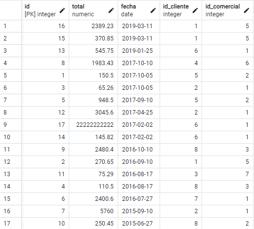

2. Devuelve todos los datos de los dos pedidos de mayor valor.

~~~sql
SELECT * FROM pedido
ORDER BY total DESC 
LIMIT 2;
~~~
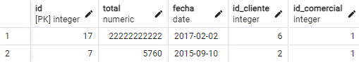

3. Devuelve un listado con los identificadores de los clientes que han realizado algún pedido. Tenga en cuenta que no debe mostrar identificadores que estén repetidos.

~~~sql
SELECT DISTINCT id_cliente, COUNT(id) as "Cantidad de pedidos" FROM pedido 
GROUP BY id_cliente 
ORDER BY id_cliente;
~~~
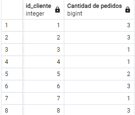

4. Devuelve un listado de todos los pedidos que se realizaron durante el año 2017, cuya cantidad total sea superior a 500€.

~~~sql
SELECT * FROM pedido 
WHERE total > 500 AND DATE_PART('YEAR', fecha) = '2017' 
ORDER BY total DESC;
~~~
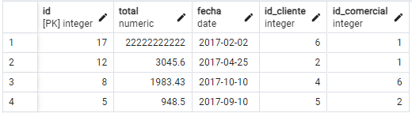

5. Devuelve un listado con el nombre y los apellidos de los comerciales que tienen una comisión entre 0.05 y 0.11.

~~~sql
SELECT nombre, apellido1,apellido2, comisión FROM comercial 
WHERE comisión BETWEEN 0.05 AND 0.11;
~~~
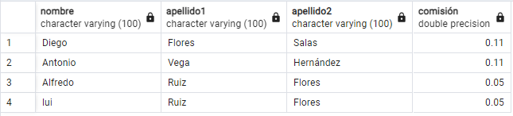

6. Devuelve el valor de la comisión de mayor valor que existe en la tabla `comercial`.

~~~sql
SELECT MAX(comisión) AS "Comision de mayor valor" FROM comercial;
~~~
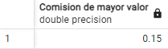

7. Devuelve el identificador, nombre y primer apellido de aquellos clientes cuyo segundo apellido **no** es `NULL`. El listado deberá estar ordenado alfabéticamente por apellidos y nombre.

~~~sql
SELECT nombre, apellido1,apellido2 FROM cliente 
WHERE apellido2 IS NOT NULL
ORDER BY nombre, apellido1,apellido2;
~~~
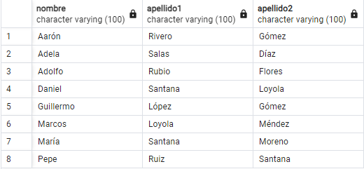

8. Devuelve un listado de los nombres de los clientes que empiezan por `A` y terminan por `n` y también los nombres que empiezan por `P`. El listado deberá estar ordenado alfabéticamente.

~~~sql
SELECT nombre as "Cliente" FROM cliente
WHERE (nombre LIKE 'A%' AND nombre LIKE '%n') OR nombre LIKE 'P%'
ORDER BY nombre;
~~~
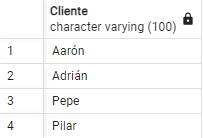

9. Devuelve un listado de los nombres de los clientes que **no** empiezan por `A`. El listado deberá estar ordenado alfabéticamente.

~~~sql
SELECT nombre AS "Cliente" FROM cliente 
WHERE nombre NOT LIKE 'A%'
ORDER BY nombre;
~~~
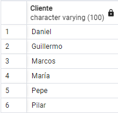

10. Devuelve un listado con los nombres de los comerciales que terminan por `el` o `o`. Tenga en cuenta que se deberán eliminar los nombres repetidos.

~~~sql
SELECT DISTINCT nombre FROM comercial 
WHERE nombre LIKE '%el' OR nombre LIKE '%o'
ORDER BY nombre;

~~~
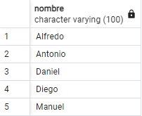

# **2. Consultas multitabla (Composición interna)**

Resuelva todas las consultas utilizando la sintaxis de `SQL1` y `SQL2`.

1. Devuelve un listado con el identificador, nombre y los apellidos de todos los clientes que han realizado algún pedido. El listado debe estar ordenado alfabéticamente y se deben eliminar los elementos repetidos.
~~~sql
SELECT DISTINCT id_cliente, c.nombre,c.apellido1,c.apellido2, COUNT(p.id) as "Cantidad de pedidos" FROM pedido p
INNER JOIN cliente c ON p.id_cliente = c.id
GROUP BY id_cliente, c.nombre,c.apellido1,c.apellido2
ORDER BY  c.nombre,c.apellido1,c.apellido2;
~~~
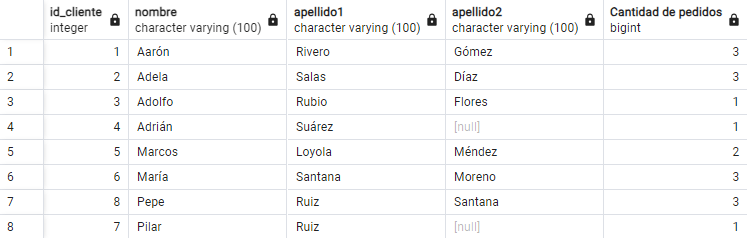
2. Devuelve un listado que muestre todos los pedidos que ha realizado cada cliente. El resultado debe mostrar todos los datos de los pedidos y del cliente. El listado debe mostrar los datos de los clientes ordenados alfabéticamente.
~~~sql
SELECT DISTINCT * FROM pedido p
INNER JOIN cliente c ON p.id_cliente = c.id
ORDER BY  c.nombre,c.apellido1,c.apellido2;
~~~
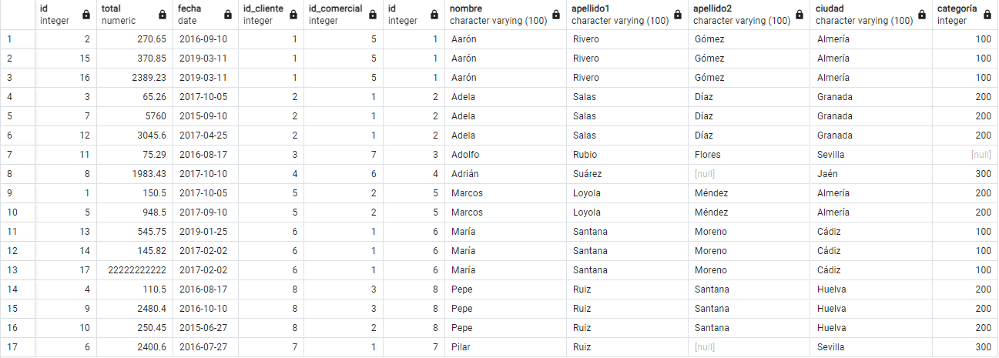
3. Devuelve un listado que muestre todos los pedidos en los que ha participado un comercial. El resultado debe mostrar todos los datos de los pedidos y de los comerciales. El listado debe mostrar los datos de los comerciales ordenados alfabéticamente.
~~~sql
SELECT DISTINCT * FROM pedido p
INNER JOIN comercial c ON p.id_cliente = c.id
ORDER BY  c.nombre,c.apellido1,c.apellido2;
~~~
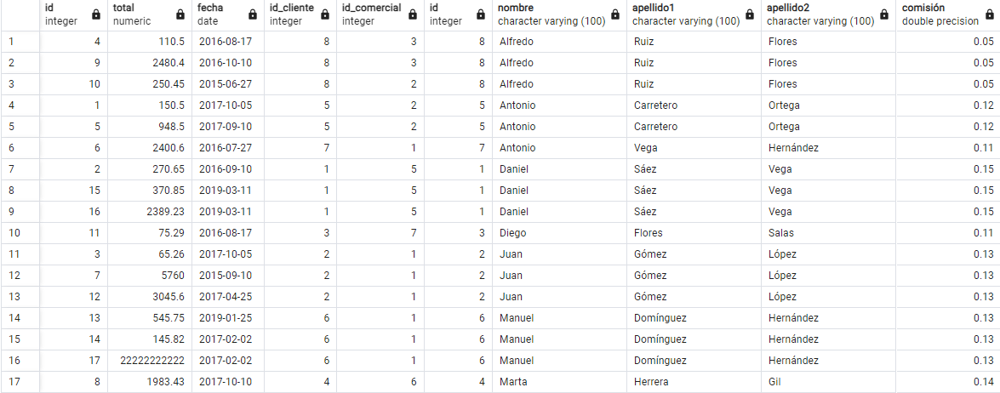
4. Devuelve un listado que muestre todos los clientes, con todos los pedidos que han realizado y con los datos de los comerciales asociados a cada pedido.

~~~SQL
SELECT DISTINCT cl.nombre AS "Cliente",
CONCAT('Total: ', p.total,' -  Fecha: ', p.fecha) AS "Pedido", 
CONCAT(c.nombre,' ',c.apellido1,' ',c.apellido2,'->',c.comisión) AS "Comercial"
FROM pedido p
INNER JOIN comercial c ON p.id_cliente = c.id
INNER JOIN cliente cl ON p.id_cliente = cl.id;
~~~
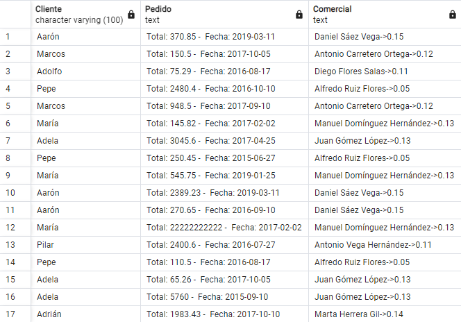

5. Devuelve un listado de todos los clientes que realizaron un pedido durante el año `2017`, cuya cantidad esté entre `300` € y `1000` €.
~~~sql
SELECT DISTINCT * FROM pedido p
INNER JOIN cliente c ON p.id_cliente = c.id
WHERE DATE_PART('YEAR', fecha) = '2017' AND total BETWEEN 300 AND 1000
ORDER BY  c.nombre,c.apellido1,c.apellido2;
~~~
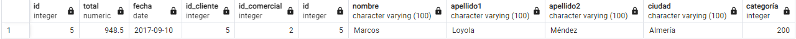
6. Devuelve el nombre y los apellidos de todos los comerciales que ha participado en algún pedido realizado por `María Santana Moreno`.
~~~sql
SELECT DISTINCT CONCAT(c.nombre,' ',c.apellido1,' ',c.apellido2) AS "Comercial" FROM pedido p
INNER JOIN comercial c ON p.id_comercial = c.id
WHERE id_cliente = 6
ORDER BY  CONCAT(c.nombre,' ',c.apellido1,' ',c.apellido2);

~~~

7. Devuelve el nombre de todos los clientes que han realizado algún pedido con el comercial `Daniel Sáez Vega`.
~~~sql

SELECT DISTINCT CONCAT(cl.nombre,' ',cl.apellido1,' ',cl.apellido2) AS "Cliente" FROM pedido p
INNER JOIN comercial c ON p.id_comercial = c.id
INNER JOIN cliente cl ON p.id_cliente = cl.id
WHERE c.id = 1
ORDER BY CONCAT(cl.nombre,' ',cl.apellido1,' ',cl.apellido2);
~~~
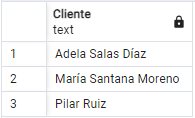

# **3. Consultas multitabla (Composición externa)**

Resuelva todas las consultas utilizando las cláusulas `LEFT JOIN` y `RIGHT JOIN`.

1. Devuelve un listado con **todos los clientes** junto con los datos de los pedidos que han realizado. Este listado también debe incluir los clientes que no han realizado ningún pedido. El listado debe estar ordenado alfabéticamente por el primer apellido, segundo apellido y nombre de los clientes.
~~~sql
SELECT * FROM cliente c
LEFT JOIN pedido p ON c.id = p.id_cliente
ORDER BY c.nombre,c.apellido1,c.apellido2;
~~~
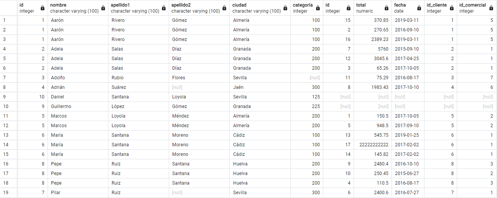
2. Devuelve un listado con **todos los comerciales** junto con los datos de los pedidos que han realizado. Este listado también debe incluir los comerciales que no han realizado ningún pedido. El listado debe estar ordenado alfabéticamente por el primer apellido, segundo apellido y nombre de los comerciales.
~~~sql
SELECT * FROM comercial c
LEFT JOIN pedido p ON c.id = p.id_comercial
ORDER BY c.nombre,c.apellido1,c.apellido2;
~~~
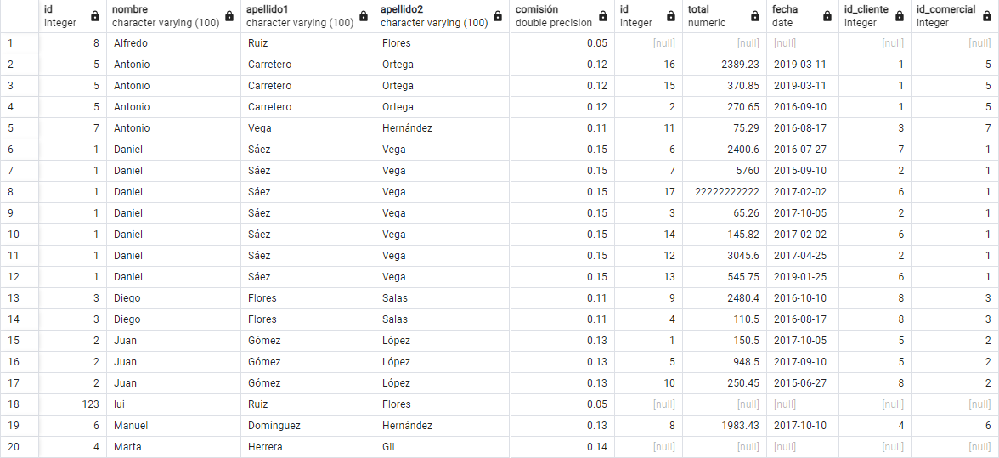
3. Devuelve un listado que solamente muestre los clientes que no han realizado ningún pedido.
~~~sql
SELECT * FROM cliente c
LEFT JOIN pedido p ON c.id = p.id_cliente
WHERE p.id IS NULL
ORDER BY c.nombre,c.apellido1,c.apellido2;
~~~
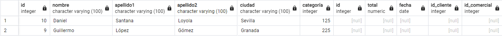
4. Devuelve un listado que solamente muestre los comerciales que no han realizado ningún pedido.
~~~sql
SELECT * FROM comercial c
LEFT JOIN pedido p ON c.id = p.id_comercial
WHERE p.id IS NULL
ORDER BY c.nombre,c.apellido1,c.apellido2;
~~~
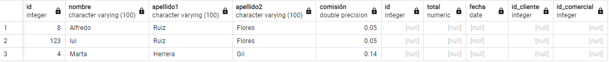
5. Devuelve un listado con los clientes que no han realizado ningún pedido y de los comerciales que no han participado en ningún pedido. Ordene el listado alfabéticamente por los apellidos y el nombre. En en listado deberá diferenciar de algún modo los clientes y los comerciales.
~~~sql
SELECT * FROM comercial c
FULL JOIN pedido p ON c.id = p.id_comercial
FULL JOIN cliente cl ON p.id_cliente = cl.id
WHERE p.id IS NULL
ORDER BY c.nombre,c.apellido1,c.apellido2;
~~~
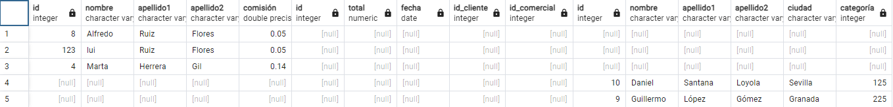
6. ¿Se podrían realizar las consultas anteriores con `NATURAL LEFT JOIN` o `NATURAL RIGHT JOIN`? Justifique su respuesta.
~~~sql
No se puede, para utilizar `NATURAL LEFT JOIN` o `NATURAL RIGHT JOIN` es necesario que los nombres de columnas en las tablas concuerde y no es el caso de nuestra base de datos.
~~~

# **4. Consultas resumen**

1. Calcula la cantidad total que suman todos los pedidos que aparecen en la tabla `pedido`.
~~~sql
SELECT SUM(total) as "Total de pedidos" FROM pedido;
~~~
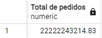
2. Calcula la cantidad media de todos los pedidos que aparecen en la tabla `pedido`.
~~~sql
SELECT AVG(total) as "Media de pedidos" FROM pedido;
~~~
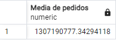
3. Calcula el número total de comerciales distintos que aparecen en la tabla `pedido`.
~~~sql
SELECT COUNT(DISTINCT id_comercial) AS "Numero de comerciales" FROM pedido;
~~~
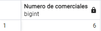
4. Calcula el número total de clientes que aparecen en la tabla `cliente`.
~~~sql
SELECT COUNT(id) FROM cliente;
~~~
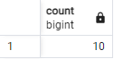
5. Calcula cuál es la mayor cantidad que aparece en la tabla `pedido`.
~~~sql
SElECT MAX(total) as "Monto mayor" FROM pedido;
~~~
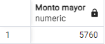
6. Calcula cuál es la menor cantidad que aparece en la tabla `pedido`.
~~~sql
SElECT MIN(total) as "Monto menor" FROM pedido;
~~~
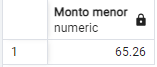
7. Calcula cuál es el valor máximo de categoría para cada una de las ciudades que aparece en la tabla `cliente`.
~~~sql
SELECT c.categoría, c.ciudad, MAX(total) FROM pedido p
INNER JOIN cliente c ON c.id = p.id_cliente
GROUP BY categoría, ciudad HAVING categoría IS NOT NULL
ORDER BY MAX(total) DESC;
~~~
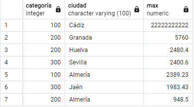
8. Calcula cuál es el máximo valor de los pedidos realizados durante el mismo día para cada uno de los clientes. Es decir, el mismo cliente puede haber realizado varios pedidos de diferentes cantidades el mismo día. Se pide que se calcule cuál es el pedido de máximo valor para cada uno de los días en los que un cliente ha realizado un pedido. Muestra el identificador del cliente, nombre, apellidos, la fecha y el valor de la cantidad.
~~~sql
SELECT p.id_cliente, MAX(total), DATE_PART('DAY', fecha) FROM pedido p
INNER JOIN cliente c ON c.id = p.id_cliente
GROUP BY DATE_PART('DAY', fecha),p.id_cliente;
~~~
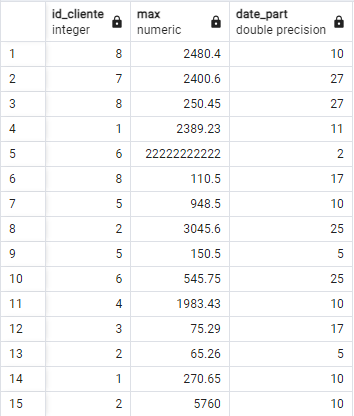
9. Calcula cuál es el máximo valor de los pedidos realizados durante el mismo día para cada uno de los clientes, teniendo en cuenta que sólo queremos mostrar aquellos pedidos que superen la cantidad de 2000 €.
~~~sql
SELECT p.id_cliente, MAX(total), DATE_PART('DAY', fecha) FROM pedido p
INNER JOIN cliente c ON c.id = p.id_cliente
GROUP BY DATE_PART('DAY', fecha),p.id_cliente HAVING MAX(total) > 2000;
~~~
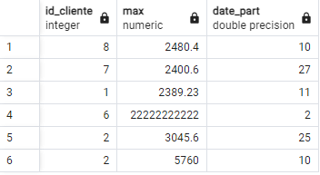
10. Calcula el máximo valor de los pedidos realizados para cada uno de los comerciales durante la fecha `2016-08-17`. Muestra el identificador del comercial, nombre, apellidos y total.
~~~sql
SELECT p.id_comercial,p.fecha, MAX(total) FROM pedido p
INNER JOIN comercial c ON c.id = p.id_comercial
GROUP BY p.id_comercial,p.fecha HAVING p.fecha = '2016-08-17';
~~~
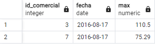
11. Devuelve un listado con el identificador de cliente, nombre y apellidos y el número total de pedidos que ha realizado cada uno de clientes. Tenga en cuenta que pueden existir clientes que no han realizado ningún pedido. Estos clientes también deben aparecer en el listado indicando que el número de pedidos realizados es `0`.
~~~sql
SELECT c.nombre, c.apellido1, c.apellido2, COUNT(p.id) FROM pedido p
RIGHT JOIN cliente c ON c.id = p.id_cliente
GROUP BY c.nombre, c.apellido1, c.apellido2;
~~~
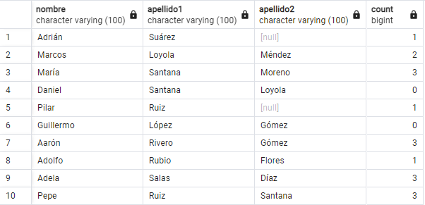
12. Devuelve un listado con el identificador de cliente, nombre y apellidos y el número total de pedidos que ha realizado cada uno de clientes **durante el año 2017**.
~~~sql
SELECT c.nombre, c.apellido1, c.apellido2,p.fecha, COUNT(p.id) FROM pedido p
INNER JOIN cliente c ON c.id = p.id_cliente
GROUP BY c.nombre, c.apellido1, c.apellido2,p.fecha HAVING DATE_PART('YEAR',p.fecha) = '2017';
~~~
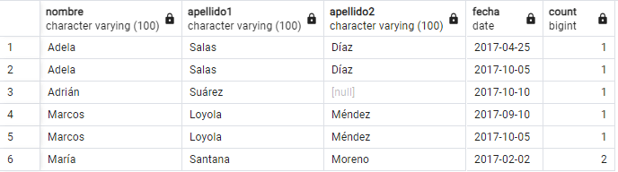
13. Devuelve un listado que muestre el identificador de cliente, nombre, primer apellido y el valor de la máxima cantidad del pedido realizado por cada uno de los clientes. El resultado debe mostrar aquellos clientes que no han realizado ningún pedido indicando que la máxima cantidad de sus pedidos realizados es `0`. Puede hacer uso de la función `[IFNULL](https://dev.mysql.com/doc/refman/8.0/en/control-flow-functions.html#function_ifnull)`.
~~~sql
SELECT c.id, coalesce(MAX(total),0) FROM pedido p
RIGHT JOIN cliente c ON c.id = p.id_cliente
GROUP BY c.id;
~~~
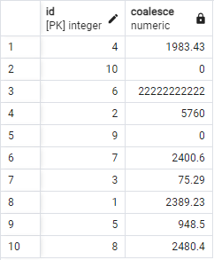
14. Devuelve cuál ha sido el pedido de máximo valor que se ha realizado cada año.
~~~sql
SELECT MAX(total), DATE_PART('YEAR', fecha) FROM pedido p
INNER JOIN cliente c ON c.id = p.id_cliente
GROUP BY DATE_PART('YEAR', fecha);
~~~
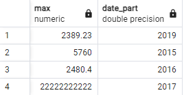
15. Devuelve el número total de pedidos que se han realizado cada año.
~~~sql
SELECT COUNT(p.id), DATE_PART('YEAR', fecha) FROM pedido p
INNER JOIN cliente c ON c.id = p.id_cliente
GROUP BY DATE_PART('YEAR', fecha);
~~~
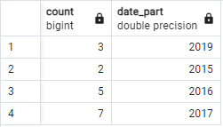

# **5. Con operadores básicos de comparación**

1. Devuelve un listado con todos los pedidos que ha realizado `Adela Salas Díaz`. (Sin utilizar `INNER JOIN`).
~~~sql
SELECT * FROM pedido WHERE id_cliente = 2;
~~~
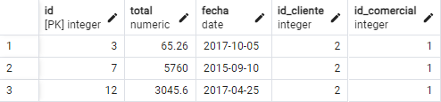
2. Devuelve el número de pedidos en los que ha participado el comercial `Daniel Sáez Vega`. (Sin utilizar `INNER JOIN`)
~~~sql
SELECT * FROM pedido WHERE id_comercial = 1;
~~~
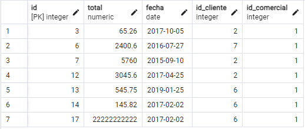
3. Devuelve los datos del cliente que realizó el pedido más caro en el año `2019`. (Sin utilizar `INNER JOIN`)
~~~sql
SELECT  c.nombre, c.apellido1, c.apellido2,DATE_PART('YEAR', fecha),MAX(total)
FROM cliente c, pedido p
WHERE c.id = p.id_cliente
GROUP BY c.nombre, c.apellido1, c.apellido2,DATE_PART('YEAR', fecha)
HAVING DATE_PART('YEAR', fecha) = '2019'
ORDER BY MAX(total) DESC 
LIMIT 1;
~~~
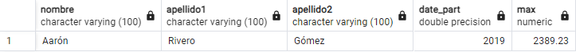
4. Devuelve la fecha y la cantidad del pedido de menor valor realizado por el cliente `Pepe Ruiz Santana`.
~~~sql
SELECT id_cliente,fecha,MIN(total)
FROM cliente c, pedido p
WHERE c.id = p.id_cliente
GROUP BY fecha,id_cliente HAVING id_cliente = 8
ORDER BY MIN(total)
LIMIT 1;
~~~
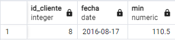
5. Devuelve un listado con los datos de los clientes y los pedidos, de todos los clientes que han realizado un pedido durante el año `2017` con un valor mayor o igual al valor medio de los pedidos realizados durante ese mismo año.
~~~sql
SELECT *
FROM cliente c, pedido p
WHERE c.id = p.id_cliente 
AND DATE_PART('YEAR', fecha) = '2017'
AND total >= (SELECT AVG(total) FROM pedido WHERE DATE_PART('YEAR', fecha) = '2016'); 
~~~
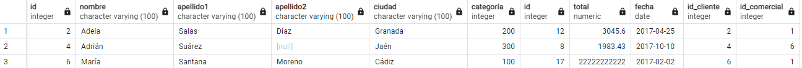
# **7. Subconsultas con `IN` y `NOT IN`**

1. Devuelve un listado de los clientes que no han realizado ningún pedido. (Utilizando `IN` o `NOT IN`).
~~~sql
SELECT * FROM cliente 
WHERE id NOT IN (SELECT id_cliente FROM pedido);
~~~
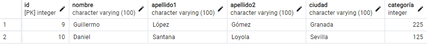
2. Devuelve un listado de los comerciales que no han realizado ningún pedido. (Utilizando `IN` o `NOT IN`).
~~~sql
SELECT * FROM comercial
WHERE id NOT IN (SELECT id_comercial FROM pedido);
~~~
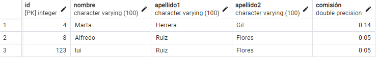
# **8. Subconsultas con `EXISTS` y `NOT EXISTS`**

1. Devuelve un listado de los clientes que no han realizado ningún pedido. (Utilizando `EXISTS` o `NOT EXISTS`).
~~~sql
SELECT * FROM cliente c
WHERE NOT EXISTS (SELECT id_cliente FROM pedido p WHERE p.id_cliente = c.id);
~~~

2. Devuelve un listado de los comerciales que no han realizado ningún pedido. (Utilizando `EXISTS` o `NOT EXISTS`).
~~~sql
SELECT * FROM comercial c
WHERE NOT EXISTS (SELECT id_comercial FROM pedido p WHERE p.id_comercial = c.id);
~~~
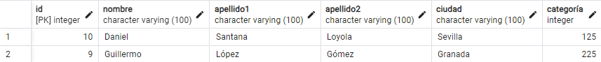